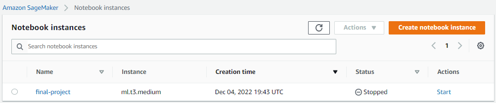
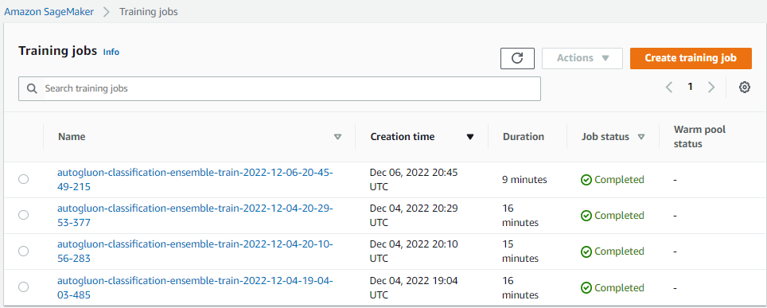
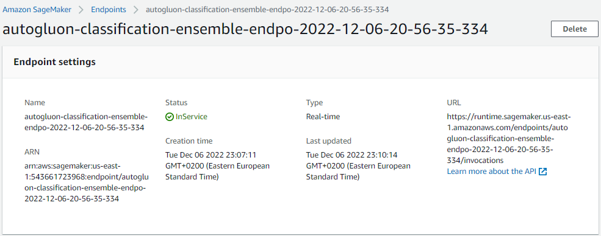

# ☕ Starbucks ML Model Sagemaker
## Project Overview
The Starbucks company provides a rewards application for its customers where they receive multiple offers, discounts as well as advertisements. Since there are alot of customer segments available and alot of different offers, it might be difficult for the company to direct each offer type to its suitable audience. The Company decided to provide a simulated dataset for the users of its app simulating their transactions and behaviours for that matter. My goal is to anaylize the given dataset and then to build a machine learning model utilizing the ideas of AutoML that can predict whether or not a user might accept an offer given the user's demographic data as well as the offer's details.
## 🌴 Environment
- AWS Notebook instance with jupyterlab hosted on an `ml.t3.medium` instance
- Kernel Chosen: `conda_python3` kernel with the following needed packages and their installed versions
```
pandas 1.3.4
numpy 1.18.5
Pandas 
seaborn 0.11.2
matplotlib 3.5.0
sagemaker 2.119.0
---
python 3.8.12
```


## 📁 Directory structure
```
+
|   dataset.csv
|   proposal.pdf
|   README.md
|   report.pdf
|   Starbucks_Capstone_notebook.ipynb
|   Starbucks_Capstone_notebook.html
|   
+---data
|       portfolio.json
|       profile.json
|       transcript.json
|       
+---processed_data
|   +---test
|   |       data.csv
|   |       
|   \---train
|           data.csv
|           
\---screenshots
        age_vs_income.png
        ConfusionMatrix.png
        deployed_endpoint.png
        Training_jobs.png
```
## 📷 screenshots
### Training jobs

### Deployed endpoint


